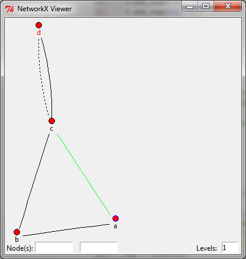

NetworkX Viewer
================

[](https://travis-ci.org/jsexauer/networkx_viewer)

Introduction
------------

NetworkX Viewer provides a basic interactive GUI to view
[networkx](https://networkx.github.io/) graphs.  In addition to standard
plotting and layout features as found natively in networkx, the GUI allows
you to:

  - Drag nodes around to tune the default layout
  - Show and hide nodes
  - Filter nodes
  - Pan and zoom
  - Display nodes only within a certain number of hops ("levels") of
    a "home node"
  - Display and highlight the shortest path between two nodes.  Nodes
    around the path can also be displayed within a settable number of
    levels
  - Intelligently find and display nodes near displayed nodes using
    "Grow" and "Grow Until" functions
  - Use attributes stored in the graph's node and edge dictionaries to
    customize the appearance of the node and edge tokens in the GUI
  - Mark nodes and edges for reference
  - Support for both `nx.Graph` and `nx.MultiGraph`

A typical usage might be:
```python
import networkx as nx
from networkx_viewer import Viewer

G = nx.MultiGraph()
G.add_edge('a','b')
G.add_edge('b','c')
G.add_edge('c','a',0,{'fill':'green'})
G.add_edge('c','d')
G.add_edge('c','d',1,{'dash':(2,2)})
G.node['a']['outline'] = 'blue'
G.node['d']['label_fill'] = 'red'

app = Viewer(G)
app.mainloop()
```

The result will be:



Installation
------------

NetworkX Viewer is hosted on PyPI and can be installed by simply doing the
following.
```
pip install networkx_viewer
```

NetworkX Viewer requires [NetworkX](https://networkx.github.io/) version 1.4 or greater.


Using the GUI
-------------
The default layout for the nodes is to use `nx.spring_layout`.  While this
layout is pretty good, it is not perfect, so the GUI supports standard features
like rearranging the nodes, panning, and zooming.

By default, the viewer will display the entire graph on initialization.
However, most of the power in the GUI comes in showing a subset of the graph.
You can specify a subgraph to display using:
```python
app = Viewer(G, home_node='a', levels=1)
```

### Constructing a plot

On the right of the screen is a box to enter node(s) to graph.
  - If you enter a single node, that node plus nodes upto "Neighbor Levels"
    levels will be ploted.
  - If you enter a pair of nodes, the shortest path between the nodes will
    be found.  Neighbors around the path upto "Neighbor Levels" will also
    be plotted
  - If you enter three or more nodes, all those nodes will graphed out to
    "Neighbor Levels"

You may either "Build New" or "Add to Existing."  If you choose to add to the
existing plot, and a path exists between the new node and your existing display
island, you will be prompted if you'd like the program to plot the intermediate
nodes.

### Right-click functionality

Several actions can be taken by right-clicking on nodes and edges, including
  - *Grow:* Display all nodes connected to this node that may not be
    currently displayed.  A node which does not have all of its neighbors
    currently displayed will have a grey label.
  - *Grow Until:* This lets you find the path between this node and a node
    with a desired attribute.  This is done by provided a lambda function
    which may accept the following arguments:
    - `u` - Name of the Node
    - `d` - The data dictionary for the node (ie, the contents of `G.node[u]`)

    Say we had a graph which has nodes which are actors and
    edges which are the movie the two actors were both in.  A
    [classic example](http://en.wikipedia.org/wiki/Six_Degrees_of_Kevin_Bacon)
    might be to use the lambda function:
    ```python
    u=='Kevin Bacon'
    ```
    to find who the degrees of seperation are between the right-clicked actor
    and Kevin Bacon.
  - *Hide*
  - *Hide Behind:* Hide radial sections of the graph that are behind the edge
    formed by the node the cursor is currently over and the node in the menu.
    Note: if the graph is not radial behind the selected node, this item is
    greyed out in the dropdown.

You can also simply hover over a node and press the shortcut key ("G" for
grow, "H" for hide, etc...) to activate the action.

### Filtering
You can filter the nodes to display based on the attributes a node possess.
This is done in a simmilar manner to how *Grow Until* works, as described above.
You must write a lambda function which accepts the following paramaters:
 - `u` - Name of the Node
 - `d` - The data dictionary for the node (ie, the contents of `G.node[u]`)

When this lambda function evaluates to `False`, the node is hidden, otherwise
the node is displayed.  Multiple Filters are ANDed together.

### Node and Edge Attributes
The attributes (ie, the dictionary stored in `G.node[u]` and `G.edge[u][v]`)
are displayed in the lower-right section of the screen.

At this time, neither the attributes not the graph's nodes/edges themselves
are editable through the GUI.  The GUI is read-only.  You should programatically
create/update the graph by doing the following:
```python
G = app.canvas.dataG
# code to edit graph
app.canvas.refresh()

```

Using the Tk Pass-through
-------------------------
If the data dictionary stored in the graph for an edge or node contains a key
that can be used by Tk, the token will be customized as such.  Specifically,

  - If a node contains a key used to configure
    [Tkinter.Canvas.create_oval][1], it will be used to customize the node's
    marker (ie, the red circle).
  - If a node contains a key prefixed with "label_" (for example, "label_font"
    or "label_fill") that can be used to configure
    [Tkinter.Canvas.create_text][2], it will be used to customize the node's
    label.
  - If an edge contains a key which can be used by
    [Tkinter.Canvas.create_line][3], it will be used to customize the edge's
    display properties.

[1]: http://effbot.org/tkinterbook/canvas.htm#Tkinter.Canvas.create_oval-method
[2]: http://effbot.org/tkinterbook/canvas.htm#Tkinter.Canvas.create_text-method
[3]: http://effbot.org/tkinterbook/canvas.htm#Tkinter.Canvas.create_line-method

Expanding and Customizing the GUI
---------------------------------
The core Tk widget that is implemented by networkx_viewer is the `GraphCanvas`
widget.  If you simply wish to use the GUI as presented as part of a larger
application, you can just instantiate the canvas, passing it the graph to
display as an argument and pack or grid it into your Tk application like any
other canvas widget.

If you wish to change the tokens used for edges or nodes, subclass `NodeToken`
or `EdgeToken` and pass as an argument into the GraphCanvas as such.  For
example:

```python
import Tkinter as tk
import networkx as nx
from networkx_viewer import NodeToken, GraphCanvas

class CustomNodeToken(NodeToken):
    def render(self, data, node_name):
        """Example of custom Node Token
        Draw a circle if the node's data says we are a circle, otherwise
        draw us as a rectangle.  Also, if data contains a color key,
        use that as our color (default, red)
        """
        # For our convenience, the render method is called with the
        #  graph's data attributes and the name of the node in the graph

        # Note that NodeToken is a subclass of Tkinter.Canvas, so we
        #  simply draw on ourselves to create the apperance for the node.

        # Make us 50 pixles big
        self.config(width=50, height=50)

        # Set color and other options
        marker_options = {'fill':       data.get('color','red'),
                          'outline':    'black'}

        # Draw circle or square, depending on what the node said to do
        if data.get('circle', None):
            self.create_oval(0,0,50,50, **marker_options)
        else:
            self.create_rectangle(0,0,50,50, **marker_options)

class ExampleApp(tk.Tk):
    def __init__(self, graph, **kwargs):
        tk.Tk.__init__(self)

        self.canvas = GraphCanvas(graph, NodeTokenClass=CustomNodeToken,
            **kwargs)
        self.canvas.grid(row=0, column=0, sticky='NESW')

G = nx.path_graph(5)
G.node[2]['circle'] = True
G.node[3]['color'] = 'blue'

app = ExampleApp(G)
app.mainloop()

```

Development Status
==================
As of September 2014, networkx_viewer is under active development.  Bugs or feature
requests should be submitted to the
[github issue tracker](https://github.com/jsexauer/networkx_viewer/issues).

